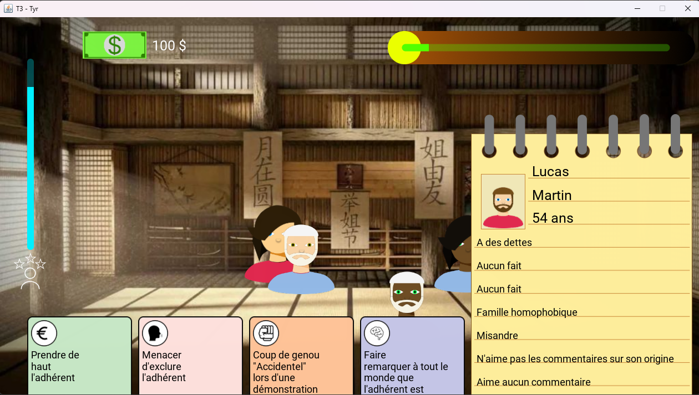

# T3 - MAJ23-T3-B

## Description
Ce projet est un serious game traitant le sujet de la violence au sens large. Il a été réalisé dans le cadre du module T3 du BUT Informatique de l'IUT Robert Schuman.

## Auteurs
* [Dimitri TOUPENSE](https://github.com/DimToups)
* [Anatole VOLTZ](https://github.com/pandar0ux)
* [Tom CZEKAJ](https://github.com/Xen0Xys)

## Prévisualisation

## Informations techniques
### Technologies utilisées
* [Java 21](https://www.oracle.com/java/technologies/javase-downloads.html)
* [Swing 1.4.2](https://docs.oracle.com/en/java/javase/21/docs/api/java.desktop/javax/swing/package-summary.html)
* [Maven 4.0.0](https://maven.apache.org/download.cgi)
### Outils utilisés
* [IntelliJ IDEA 2023.3.2](https://www.jetbrains.com/fr-fr/idea/download/#section=windows)
* [Git 2.39.1](https://git-scm.com/downloads)
* [Gitlab Unistra](https://gitlab.unistra.fr/)

## Lancement du projet
1. Clonez le dépôt Git : `git clone https://gitlab.unistra.fr/MAJ23-T3-B.git`
2. Ouvrez le projet dans IntelliJ IDEA.
3. Lancez le Main du projet.

## Installation
Pour installer le jeu, il vous suffit de télécharger l'installateur fourni dans la section [Releases](https://git.unistra.fr/czekaj/t3-maj23-t3-b/-/releases).

## Licence
Ce projet est sous licence CC-BY-NC-SA. Voir le fichier `LICENSE` pour plus de détails.
